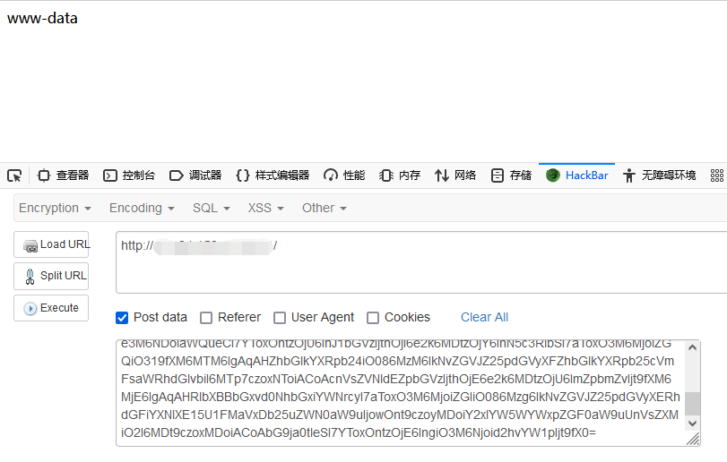

## CodeIgniter4 反序列化链 RCE2

### 漏洞环境

执行如下命令启动一个 `CodeIgniter4.0.4` 的环境：

```
docker-compose up -d
```

访问 http://x.x.x.x/ ，看到 `hello world` 既搭建成功

测试代码

```php
<?php namespace App\Controllers;

class Home extends BaseController
{
	public function index()
	{
		if(isset($_POST['a']))
		{
			unserialize(base64_decode($_POST['a']));
		}
		else
		{
			return "hello world";
		}
		#return view('welcome_message');
	}
}
```

### 漏洞影响

4.0.0-rc.4 <= 4.0.4+

### 漏洞分析

https://forum.butian.net/share/784

### 漏洞复现




### 漏洞 EXP

[codeigniter4_unserialize_rce2](./codeigniter4_unserialize_rce2.php)


